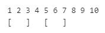

Facebook Coding Problems

https://www.metacareers.com/profile/coding_puzzles

# All Wrong

There's a multiple-choice test with questions, numbered from 1 to N
Each question has 2 answer options, labelled A and B. You know that the correct answer for the
ith question is the ith character in the string C, which is either "A" or "B", but you want to get a score of 0 on this test by answering every question incorrectly.

Your task is to implement the function getWrongAnswers(N, C) which returns a string with N characters, the ith of which is the answer you should give for question i in order to get it wrong (either "A" or "B").

Constraints
1 ≤ N ≤ 100
1≤N≤100
Ci ∈ {"A","B"}

Sample test case #1
N = 3
C = ABA
Expected Return Value = BAB

Sample test case #2
N = 5
C = BBBBB
Expected Return Value = AAAAA

Sample Explanation
In the first case the correct answers to the 3 questions are A, B, and A, in that order. Therefore, in order to get them all wrong, the 3 answers you should give are B, A, and B, in that order.

In the second case the correct answers are all B, so you should answer each question with A.

# Battleship

You're playing Battleship on a grid of cells with R rows and C columns.
There are 0 or more battleships on the grid, each occupying a single distinct cell.
The cell in the ith row from the top and jth column from the left either contains a battleship (Gi,j = 1) or doesn't (G i,j = 0).

You're going to fire a single shot at a random cell in the grid. You'll choose this cell uniformly at random from the R∗C possible cells.
You're interested in the probability that the cell hit by your shot contains a battleship.

Your task is to implement the function getHitProbability(R, C, G) which returns this probability.

Note: Your return value must have an absolute or relative error of at most
10−6 to be considered correct.

Sample test case #1
R = 2
C = 3
G = 0 0 1
1 0 1
Expected Return Value = 0.50000000

Sample test case #2
R = 2
C = 2
G = 1 1
1 1
Expected Return Value = 1.00000000

Sample Explanation
In the first case, 3 of the 6 cells in the grid contain battleships. Therefore, the probability that your shot will hit one of them is 3/6=0.5

In the second case, all 4 cells contain battleships, resulting in a probability of 1.0 of hitting a battleship.

# Cafeteria

A cafeteria table consists of a row of N seats, numbered from 1 to N from left to right.
Social distancing guidelines require that every diner be seated such that K seats to their left and K seats to their right (or all the remaining seats to that side if there are fewer than K) remain empty.

There are currently M diners seated at the table, the ith of whom is in seat Si​.
No two diners are sitting in the same seat, and the social distancing guidelines are satisfied.

Determine the maximum number of additional diners who can potentially sit at the table without social distancing guidelines being violated for any new or existing diners, assuming that the existing diners cannot move and that the additional diners will cooperate to maximize how many of them can sit down.

_Please take care to write a solution which runs within the time limit._

## Constraints

1≤N≤1015
1≤K≤N
1≤M≤500,000
M≤N
1≤Si≤N

## Sample test case #1

N = 10
K = 1
M = 2
S = [2, 6]
Expected Return Value = 3

## Sample test case #2

N = 15
K = 2
M = 3
S = [11, 6, 14]
Expected Return Value = 1

In the first case, the cafeteria table has N=10 seats, with two diners currently at seats 2 and 6 respectively.
The table initially looks as follows, with brackets covering the K=1 seat to the left and right of each existing diner that may not be taken.

    

Three additional diners may sit at seats 4, 8, and 10 without violating the social distancing guidelines.

In the second case, only 1 additional diner is able to join the table, by sitting in any of the first 3 seats.
